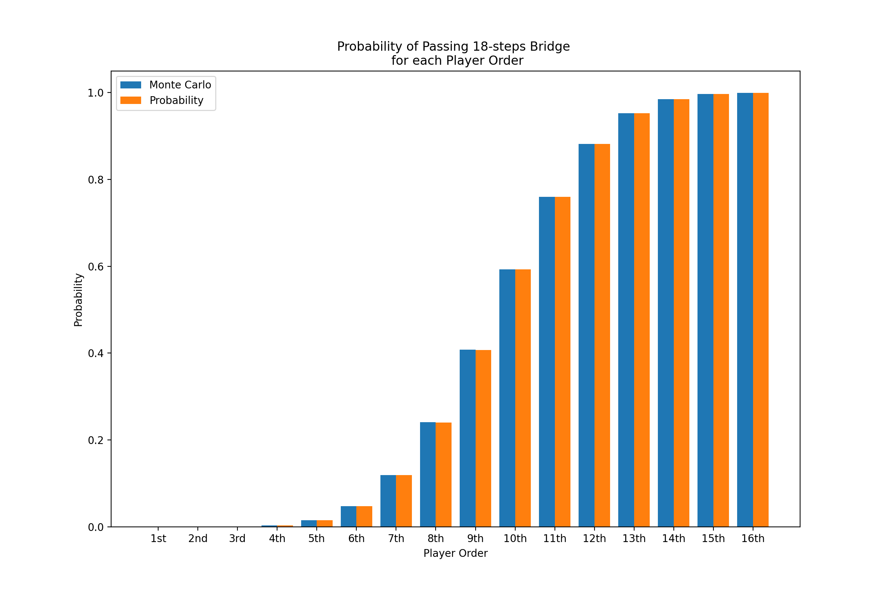

# glass-bridge-game
This is an attempt to use monte carlo methods to calculate the probability of a player crossing the glass bridge successfully from the squid game(Netflix) 

I built a simulation where I set up the environment to match up the game variables. Then I used a random generator to decide the player's next move hoping that if we do this process more than 10000 times, we will reach the exact probability of the player crossing the bridge based on his order. 

Thankfully we succeeded, and the following plot compares the Monte Carlo simulation results to the calculated results. 

